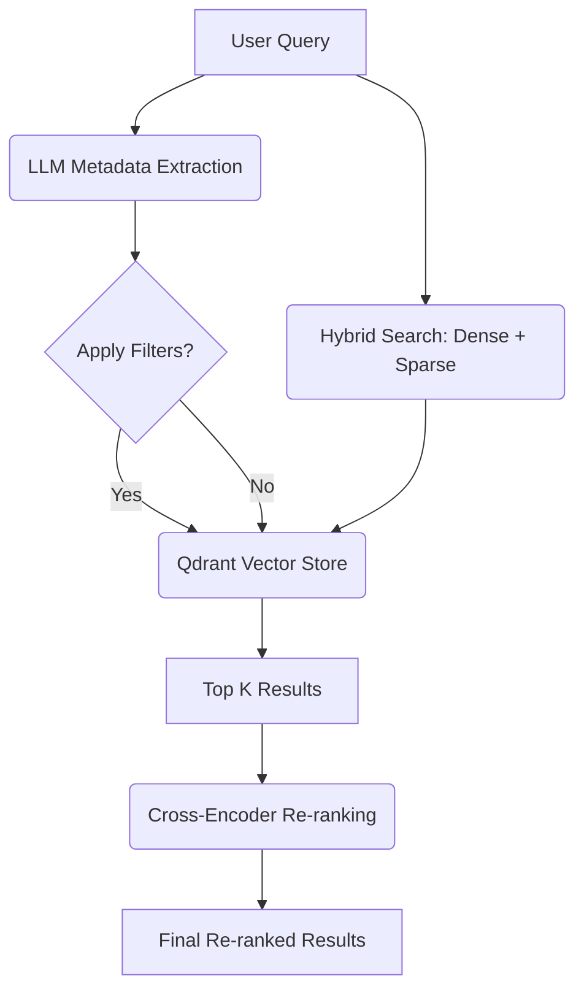

# Data Retrieval: Hybrid Search, Cross-Encoder, and Re-Ranking

## Anatomy of a Deep RAG Pipeline for Financial Documents


This sub-project focuses on implementing advanced retrieval strategies for a Deep RAG (Retrieval-Augmented Generation) pipeline. It combines dense and sparse search techniques with metadata filtering and re-ranking to achieve high-precision information retrieval.

## Table of Contents
- [Overview](#overview)
- [Key Features](#key-features)
- [Retrieval Architecture](#retrieval-architecture)
- [Project Structure](#project-structure)
- [Getting Started](#getting-started)
- [Technologies Used](#technologies-used)

## Overview
Standard RAG systems often rely solely on dense vector embeddings, which can sometimes miss specific keywords or fail to handle complex filters. This implementation addresses these limitations by using a **Hybrid Search** approach, combining the semantic power of dense embeddings with the keyword precision of sparse embeddings (BM25), followed by a **Cross-Encoder Re-ranking** step to ensure the most relevant chunks are prioritized.

## Key Features
- **Dense Retrieval**: Uses the `intfloat/e5-large-v2` model for high-quality semantic embeddings.
- **Sparse Retrieval**: Implements keyword-based search using `Qdrant/bm25` (via FastEmbed).
- **Hybrid Search**: Fuses dense and sparse results using Qdrant's native hybrid search capabilities.
- **LLM-Based Metadata Extraction**: Automatically extracts filtering criteria (company name, document type, fiscal year, etc.) from natural language queries using Gemini.
- **Metadata Filtering**: Applies strict keyword filters in Qdrant based on the extracted metadata to narrow down the search space.
- **Cross-Encoder Re-ranking**: Refines the top-$k$ results from the hybrid search using the `BAAI/bge-reranker-base` model for superior accuracy.

## Retrieval Architecture



## Project Structure
- **[07_Retrieval_for_Deep_RAG.ipynb](file:///Users/mdashikadnan/Documents/adnanedu/python/udemy/deep_agent/project/multi_agent_deep_rag/5_DataRetrieval_Hybrid_CrossEncoder_Re-Ranking/07_Retrieval_for_Deep_RAG.ipynb)**: The main Jupyter notebook containing the retrieval pipeline implementation, configuration, and evaluation.
- **[scripts/schema.py](file:///Users/mdashikadnan/Documents/adnanedu/python/udemy/deep_agent/project/multi_agent_deep_rag/5_DataRetrieval_Hybrid_CrossEncoder_Re-Ranking/scripts/schema.py)**: Defines Pydantic schemas for chunk metadata (e.g., `DocType`, `FiscalQuarter`) used for structured LLM extraction.

## Getting Started
1. **Activate Environment**:
   ```bash
   source .venv/bin/activate
   ```
2. **Install Dependencies**:
   ```bash
   pip install -U langchain langchain-community langchain-google-genai sentence-transformers qdrant-client langchain-qdrant fastembed
   ```
3. **Configure API Keys**: Ensure `GOOGLE_API_KEY`, `QDRANT_URL`, and `QDRANT_API_KEY` are set in your environment or `.env` file.

## Technologies Used
- **LangChain**: Framework for orchestration.
- **Qdrant**: Vector database for storage and retrieval.
- **Gemini (Google Generative AI)**: Used for metadata extraction and structured output.
- **FastEmbed**: High-performance sparse and dense embedding generation.
- **Sentence-Transformers**: Used for the Cross-Encoder re-ranking model.

---
*Developed as part of the Multi-Agent Deep RAG project.*
