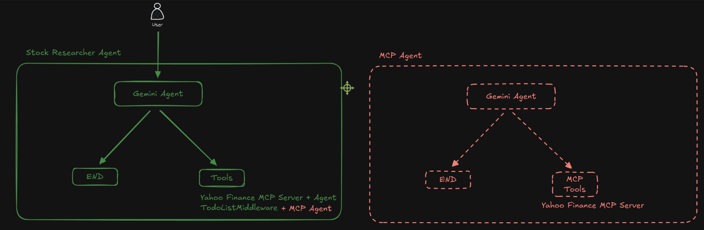
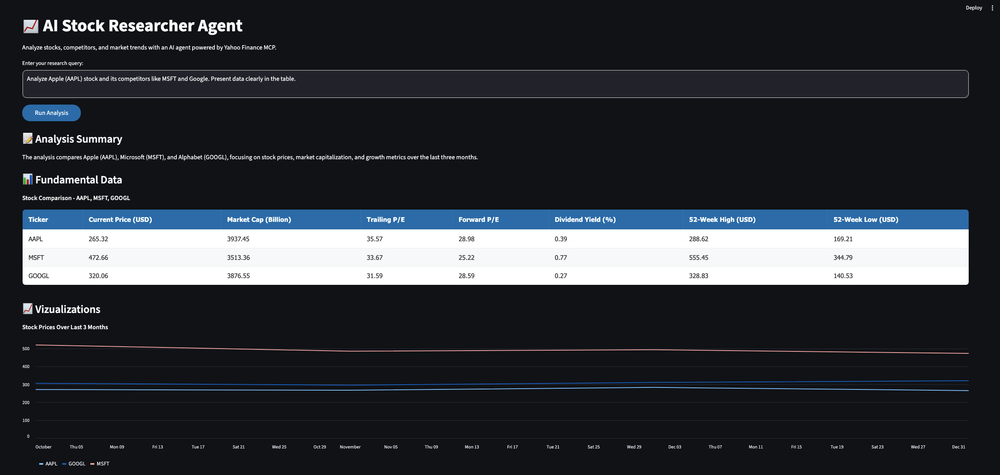
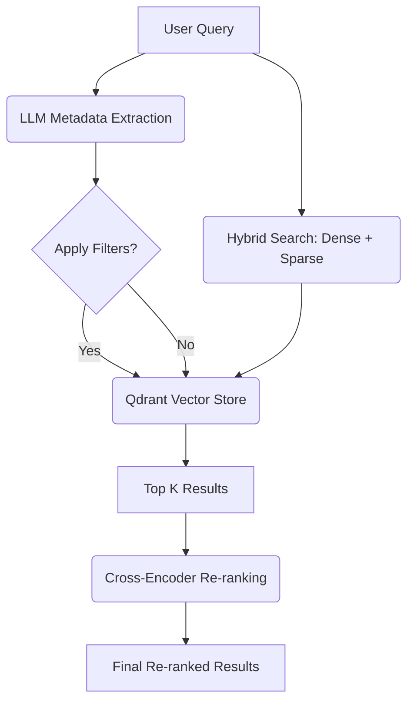
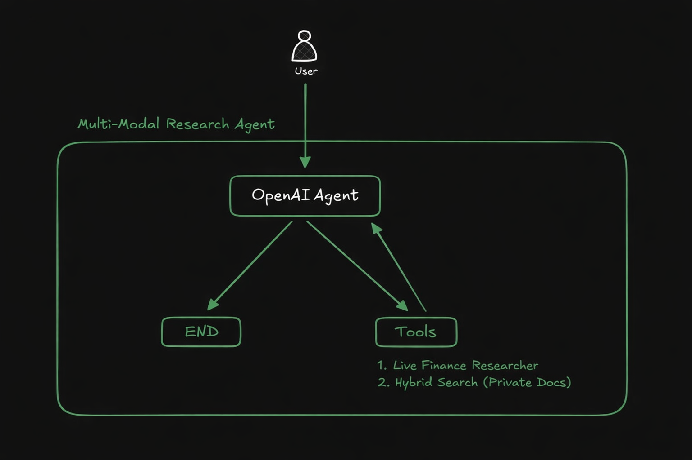
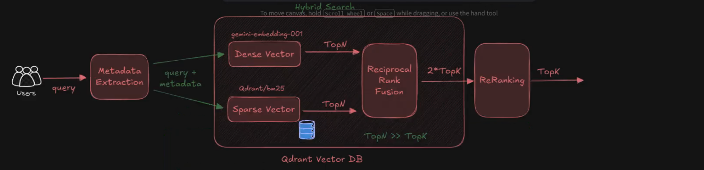
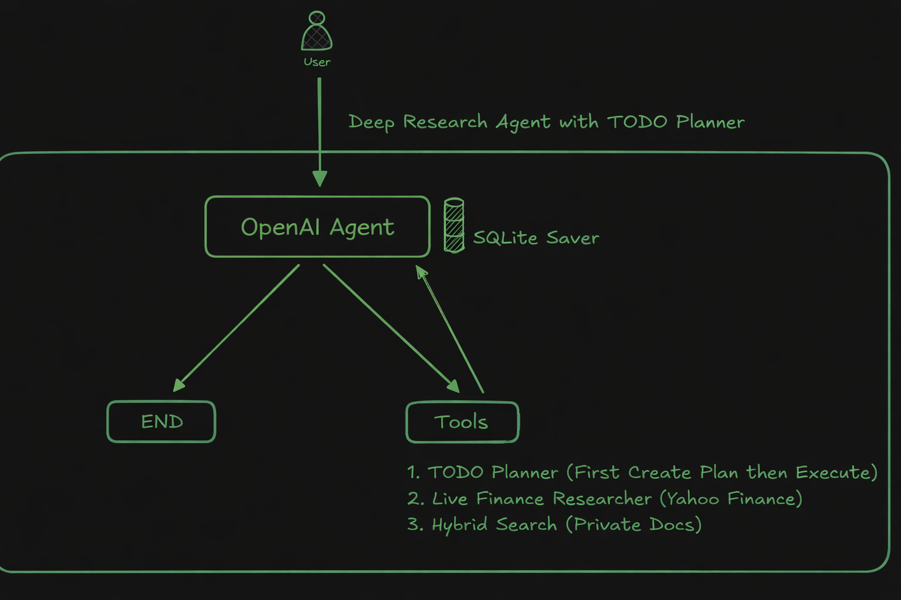
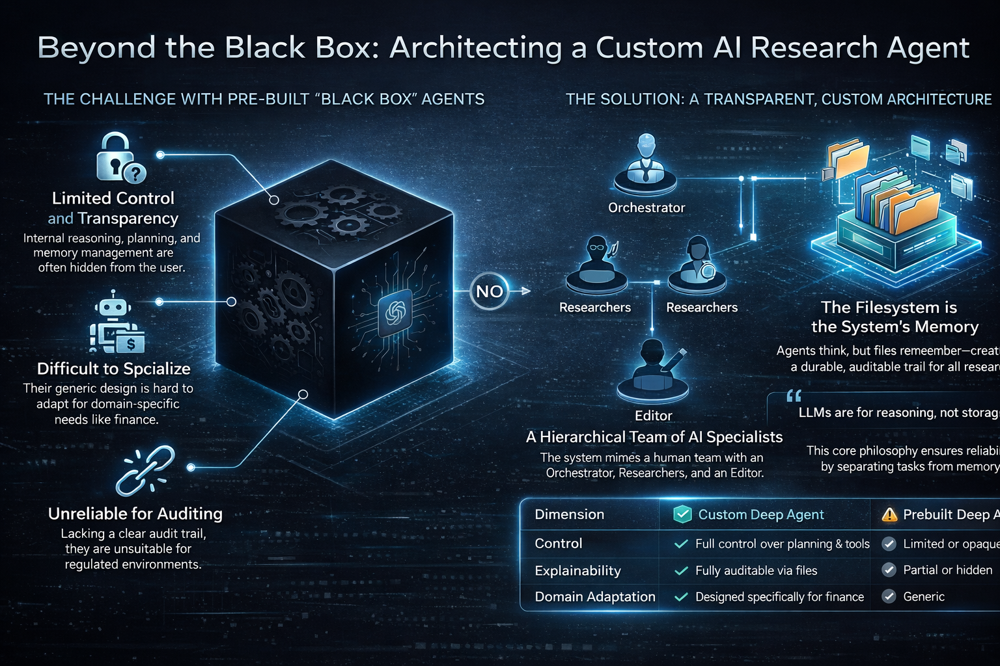
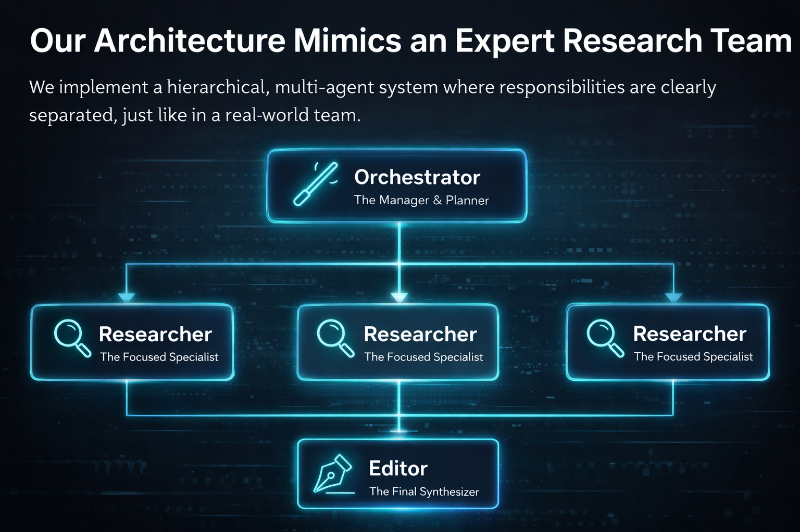
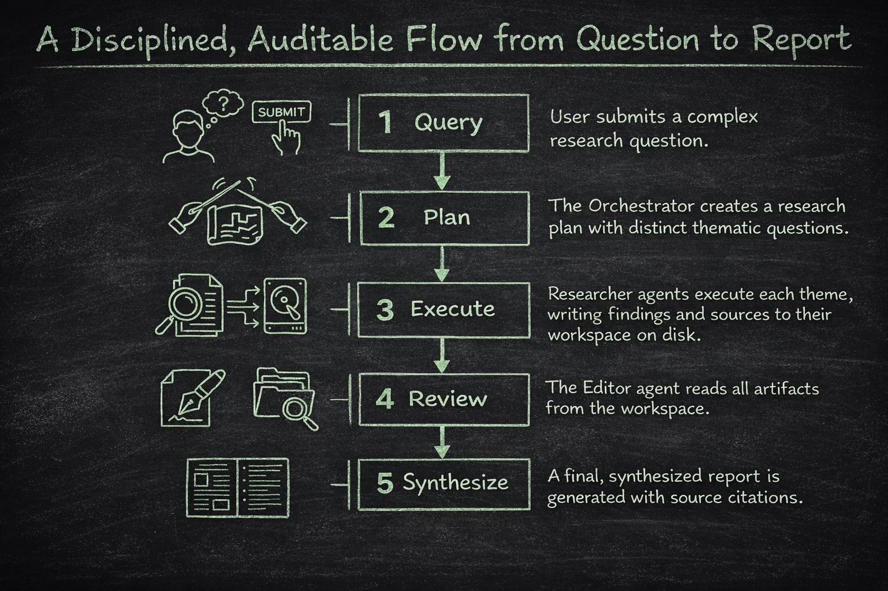

# Multi-Agent Deep RAG Project

This document aggregates the documentation for all sub-projects in the Multi-Agent Deep RAG repository.

## Table of Contents

- [📈 MCP for Finance - Stock Researcher Agent](#-mcp-for-finance---stock-researcher-agent)
- [Multimodal Data Extraction with Docling](#multimodal-data-extraction-with-docling)
- [Image Description Generation with Multi-Modal LLMs](#image-description-generation-with-multi-modal-llms)
- [Bulk Data Ingestion with Qdrant for Deep RAG](#bulk-data-ingestion-with-qdrant-for-deep-rag)
- [Data Retrieval: Hybrid Search, Cross-Encoder, and Re-Ranking](#data-retrieval-hybrid-search-cross-encoder-and-re-ranking)
- [Multimodal Financial Research Agent](#multimodal-financial-research-agent)
- [Deep Finance Researcher with TODO Planner](#deep-finance-researcher-with-todo-planner)
- [Multi-Agent Deep AI Finance Researcher from Scratch](#multi-agent-deep-ai-finance-researcher-from-scratch)
- [Deep Agent - Langchain's Multi-Agent Deep Researcher](#deep-agent---langchains-multi-agent-deep-researcher)
- [Acknowledgments](#acknowledgments)


---

# 📈 MCP for Finance - Stock Researcher Agent

A comprehensive financial research assistant powered by **Model Context Protocol (MCP)** and **LangChain**. This agent leverages the Yahoo Finance MCP server to perform real-time stock analysis, competitor research, and market trend tracking, presenting the data in a rich, interactive Streamlit application.



## 🚀 Overview

The **Stock Researcher Agent** is designed to bridge the gap between large language models and real-time financial data. By using the **Yahoo Finance MCP Server**, the agent can autonomously query stock prices, news, financial statements, and analyst recommendations.

*   **Architecture**:
    *   **Frontend**: [Streamlit](https://streamlit.io/) for a polished, collaborative user interface.
    *   **Orchestration**: [LangChain](https://www.langchain.com/) for agentic workflow and tool management.
    *   **Intelligence**: `gpt-4o-mini` (via LangChain OpenAI) for reasoning and data synthesis.
    *   **Data Layer**: `yahoo-finance-mcp-server` accessed via `langchain-mcp-adapters`.

## 📱 Stock Researcher App



The application provides a "fancy" and intuitive interface for your financial queries. Key features include:

*   **Intelligent Analysis**: Enter natural language queries (e.g., "Analyze Apple vs. Microsoft").
*   **Structured Reports**: View financial metrics in clean, styled data tables.
*   **Dynamic Visualizations**: Interactive charts for stock price history and comparative performance.
*   **Automated Cleanup**: The agent manages its own resources, ensuring clean shutdowns of MCP servers.

---
*Created by Deep Agent.*


---

# Multimodal Data Extraction with Docling

This project focuses on extracting high-quality, structured data from complex financial PDF documents using the **Docling** library. It automates the conversion of unstructured PDFs into machine-readable formats suitable for RAG (Retrieval-Augmented Generation) pipelines.

## Project Overview

The objective is to process financial reports (like 10-K, 10-Q) and extract not just text, but also visual and tabular data while maintaining context and structural integrity.

## PDF Data Extraction Pipeline Flow


## Key Features

- **Automated Metadata Extraction**: Parses filenames (e.g., `Apple 10-K 2023.pdf`) to identify the company, document type, and fiscal period.
- **Markdown Conversion**: Converts PDF content to Markdown with explicit page breaks (`<!-- page break -->`) for precise chunking.
- **Intelligent Image Extraction**: Identifies and saves significant visual elements (charts, diagrams) based on size thresholds (e.g., >500x500 pixels).
- **Context-Aware Table Extraction**: Extracts tables into individual Markdown files, preserving the preceding context (paragraphs) and page metadata for better searchability.

## Workflow

1.  **Setup**: Configure directory paths for input PDFs and categorized outputs.
2.  **Conversion**: Initialize `DocumentConverter` with specialized `PdfPipelineOptions`.
3.  **Processing**:
    - Iterate through document items to locate pictures and tables.
    - Filter and save high-resolution images.
    - Segment and save tables with a 2-paragraph "look-back" context.
4.  **Export**: Write the full document Markdown and granular table/image assets to structured subdirectories.

## Directory Structure

Processed data is organized logically by company and document:

```text
data/rag-data/
├── markdown/  # Full document text
├── images/    # High-res charts and diagrams
└── tables/    # Extracted tables with context
```

## Requirements

- `docling`: Core library for document conversion.
- `docling-core`: Schema and type definitions.
- `pathlib`: For robust filesystem interactions.

---
*Developed as part of the Multi-Agent Deep RAG project.*


---

# Image Description Generation with Multi-Modal LLMs

This part of the project focuses on transforming visual data extracted from financial PDFs into detailed, searchable textual descriptions using state-of-the-art Multi-Modal Large Language Models (LLMs).

## Overview

Complex financial documents often contain charts, graphs, and tables that are difficult for traditional text-based RAG pipelines to index. This project bridges that gap by using vision-capable LLMs like **Qwen2.5-VL** to generate comprehensive textual insights for every significant image extracted from the reports.

## Key Features

- **Multi-Modal Visual Understanding**: Utilizes advanced vision models to "read" charts, graphs, and document pages.
- **Specialized Financial Prompts**: Employs domain-specific prompting to focus on metrics, data points, trends (growth/decline), and row/column extraction from tables.
- **Automated Batch Processing**: Uses recursive directory scanning (`rglob`) to identify and process all page-level images across different companies and documents.
- **RAG-Ready Outputs**: Saves descriptions as structured Markdown files, enabling seamless integration into vector databases for enhanced retrieval.

## Workflow

1.  **Environment Setup**: Loads API keys and initializes the HuggingFace Inference Client for **Qwen2.5-VL**.
2.  **Asset Discovery**: Scans the `rag-data/images` directory for extracted PNG files.
3.  **Transformation**:
    - Converts images to base64 for LLM consumption.
    - Sends image + financial context prompt to the vision model.
    - Receives detailed analysis focusing on numbers and factual trends.
4.  **Persistence**: Writes descriptions to a parallel `images_desc` directory, mirrored by company and document name.

## Directory Structure

```text
data/rag-data/
├── images/        # Source PNG images (extracted in previous stage)
└── images_desc/   # Generated Markdown descriptions
    └── {company}/
        └── {document}/
            └── page_X.md
```

## Dependencies

- `huggingface_hub`: For using the **Qwen2.5-VL** multi-modal model.
- `Pillow`: Image processing and base64 conversion.
- `python-dotenv`: Management of environment variables and API keys.

---
*Developed as part of the Multi-Agent Deep RAG project.*


---

# Bulk Data Ingestion with Qdrant for Deep RAG

This project implements a robust, high-performance data ingestion pipeline that loads multimodal data into a Qdrant vector database. It supports hybrid search (Dense + Sparse) and handles various data types extracted from complex documents.

## Project Overview

The ingestion pipeline is designed to consolidate processed data—including text, tables, and image descriptions—into a single Qdrant collection. It features intelligent deduplication and rich metadata tagging to enable precise filtering and retrieval for Deep RAG applications.

## Key Features

- **Hybrid Search Architecture**: Integrates Google Gemini (Dense) and BM25 (Sparse) embeddings for superior retrieval accuracy.
- **Multimodal Support**:
    - **Markdown**: Page-level text chunks.
    - **Tables**: Extracted table data with preserved context.
    - **Images**: Text descriptions generated by Multimodal LLMs.
- **Incremental Ingestion**: Uses SHA-256 file hashing to prevent duplicate uploads and support incremental updates.
- **Rich Metadata filtering**: Documents are tagged with company, year, quarter, document type, and page number for advanced filtering queries.

## Ingestion Workflow

1.  **Environment Setup**: Connect to Qdrant (Local or Cloud) and initialize embedding models.
2.  **Collection Configuration**: Create or update the Qdrant collection with optimized vector dimensions and search parameters.
3.  **Data Processing**:
    - **Metadata Extraction**: Automatically parses filenames to determine document context.
    - **Hashing**: Computes hashes for all files to maintain an ingestion registry.
4.  **Bulk Upload**:
    - Chunks markdown files based on page breaks.
    - Ingests tables and image descriptions with associated metadata.
5.  **Verification**: Performs similarity searches to validate the integrity and accessibility of the ingested data.

---
*Part of the Multi-Agent Deep RAG implementation series.*


---

# Data Retrieval: Hybrid Search, Cross-Encoder, and Re-Ranking

## Anatomy of a Deep RAG Pipeline for Financial Documents


This sub-project focuses on implementing advanced retrieval strategies for a Deep RAG (Retrieval-Augmented Generation) pipeline. It combines dense and sparse search techniques with metadata filtering and re-ranking to achieve high-precision information retrieval.

## Table of Contents
- [Overview](#overview)
- [Key Features](#key-features)
- [Retrieval Architecture](#retrieval-architecture)
- [Project Structure](#project-structure)
- [Getting Started](#getting-started)
- [Technologies Used](#technologies-used)

## Overview
Standard RAG systems often rely solely on dense vector embeddings, which can sometimes miss specific keywords or fail to handle complex filters. This implementation addresses these limitations by using a **Hybrid Search** approach, combining the semantic power of dense embeddings with the keyword precision of sparse embeddings (BM25), followed by a **Cross-Encoder Re-ranking** step to ensure the most relevant chunks are prioritized.

## Key Features
- **Dense Retrieval**: Uses the `intfloat/e5-large-v2` model for high-quality semantic embeddings.
- **Sparse Retrieval**: Implements keyword-based search using `Qdrant/bm25` (via FastEmbed).
- **Hybrid Search**: Fuses dense and sparse results using Qdrant's native hybrid search capabilities.
- **LLM-Based Metadata Extraction**: Automatically extracts filtering criteria (company name, document type, fiscal year, etc.) from natural language queries using Gemini.
- **Metadata Filtering**: Applies strict keyword filters in Qdrant based on the extracted metadata to narrow down the search space.
- **Cross-Encoder Re-ranking**: Refines the top-$k$ results from the hybrid search using the `BAAI/bge-reranker-base` model for superior accuracy.

## Retrieval Architecture



## Project Structure
- **[07_Retrieval_for_Deep_RAG.ipynb](file:///Users/mdashikadnan/Documents/adnanedu/python/udemy/deep_agent/project/multi_agent_deep_rag/5_DataRetrieval_Hybrid_CrossEncoder_Re-Ranking/07_Retrieval_for_Deep_RAG.ipynb)**: The main Jupyter notebook containing the retrieval pipeline implementation, configuration, and evaluation.
- **[scripts/schema.py](file:///Users/mdashikadnan/Documents/adnanedu/python/udemy/deep_agent/project/multi_agent_deep_rag/5_DataRetrieval_Hybrid_CrossEncoder_Re-Ranking/scripts/schema.py)**: Defines Pydantic schemas for chunk metadata (e.g., `DocType`, `FiscalQuarter`) used for structured LLM extraction.

## Getting Started
1. **Activate Environment**:
   ```bash
   source .venv/bin/activate
   ```
2. **Install Dependencies**:
   ```bash
   pip install -U langchain langchain-community langchain-google-genai sentence-transformers qdrant-client langchain-qdrant fastembed
   ```
3. **Configure API Keys**: Ensure `GOOGLE_API_KEY`, `QDRANT_URL`, and `QDRANT_API_KEY` are set in your environment or `.env` file.

## Technologies Used
- **LangChain**: Framework for orchestration.
- **Qdrant**: Vector database for storage and retrieval.
- **Gemini (Google Generative AI)**: Used for metadata extraction and structured output.
- **FastEmbed**: High-performance sparse and dense embedding generation.
- **Sentence-Transformers**: Used for the Cross-Encoder re-ranking model.

---
*Developed as part of the Multi-Agent Deep RAG project.*


---

# Multimodal Financial Research Agent

This project implements an intelligent financial research agent capable of performing deep market analysis by combining **Hybrid RAG (Retrieval-Augmented Generation)** on historical SEC filings with **Live Market Data** research via Yahoo Finance MCP.

The agent is designed to bridge the gap between static historical data (10-K, 10-Q) and dynamic real-time market information, providing comprehensive financial insights.

## System Architecture

The system orchestrates an intelligent agent that can route queries between historical document search and live financial tools. It utilizes a modular design where specific agents or tools handle distinct data sources.



### Key Capabilities
*   **Dual-Source Intelligence**: Seamlessly integrates long-term historical context (SEC filings) with immediate market pulse (Live Stock Data).
*   **Intelligent Routing**: The agent decides whether to use RAG for historical data or calls the Yahoo Finance MCP for real-time updates.
*   **Memory & Persistence**: Uses `LangGraph` with SQLite checkpointing to maintain conversation state and memory across interactions.

## Search Mechanism: Hybrid RAG

The project employs a robust **Hybrid Search** strategy to ensure high-precision retrieval from financial documents.



This approach combines:
1.  **Dense Retrieval**: Captures semantic meaning using embeddings.
2.  **Sparse Retrieval**: Captures exact keyword matches (e.g., specific terminologies, ticker symbols) using BM25.
3.  **Reranking**: Refines the retrieved results to ensure the most relevant chunks are passed to the Context Window.
4.  **Metadata Filtering**: Automatically extracts filters (Company, Fiscal Year, Quarter, Doc Type) from user queries to narrow down the search space.

## Models & Embeddings

Based on the analysis of the codebase, the following models and configurations are used:

| Component | Model / Technology | Description |
| :--- | :--- | :--- |
| **LLM (Reasoning)** | `gpt-4o-mini` | Used for the main agent, query analysis, and synthesis of results. |
| **Dense Embeddings** | `intfloat/e5-large-v2` | High-quality text embeddings for semantic search in Qdrant. |
| **Sparse Embeddings** | `Qdrant/bm25` | Sparse vector representation for keyword-based retrieval. |
| **Reranker** | `BAAI/bge-reranker-base` | Cross-encoder model used to score and rerank retrieved documents for better relevance. |
| **Vector Database** | `Qdrant` | Stores and manages the hybrid vectors (Dense + Sparse). |

## Project Structure

*   **`08_Multimodal_Research_Agent.ipynb`**: The main notebook that initializes the agent, defines tools, and demonstrates the workflow.
*   **`scripts/rag_tools.py`**: Contains the logic for `hybrid_search`, metadata extraction, and Qdrant client setup.
*   **`scripts/yahoo_mcp.py`**: Integrates with the Yahoo Finance MCP server to fetch live stock data, news, and financials.
*   **`scripts/schema.py`**: Defines Pydantic models for structured metadata extraction (Company, DocType, FiscalQuarter).
*   **`scripts/prompts.py`**: Stores system prompts for different agent personas (Orchestrator, Researcher, Editor).

## Setup & Usage

1.  **Environment Setup**: Ensure valid API keys for OpenAI and Qdrant are set in your environment or `.env` file.
2.  **Dependencies**: Install required packages as listed in the notebook (e.g., `langchain`, `qdrant-client`, `fastembed-gpu`).
3.  **Running the Agent**:
    *   Open `08_Multimodal_Research_Agent.ipynb`.
    *   Run the cells to initialize the Vector Store and Tools.
    *   Invoke the agent with natural language queries like:
        > "What was Apple's revenue in 2023?" (Trigger: Hybrid Search)
        > "What is the current stock price of Apple?" (Trigger: Live Finance Tool)

## Credits
Based on the **Deep Agent** course structure for building advanced Multi-Agent RAG systems.


---

# Deep Finance Researcher with TODO Planner

## Overview
This project implements an intelligent **Deep Finance Research Agent** equipped with a **TODO Planner** and **Summarization** capabilities. The agent is designed to perform comprehensive financial research by combining **Historical Data RAG** (Retrieval-Augmented Generation) from SEC filings with **Live Market Data** from Yahoo Finance.

The system leverages a multi-agent architecture (orchestrated via middleware) to manage tasks, summarize long conversations, and persistently store state, allowing for complex, multi-step financial analysis.

## Agent Architecture
The agent is built using **LangChain** and **LangGraph**, utilizing specialized middleware for task management and memory optimization.



### Key Features
*   **Hybrid Search RAG**: Retrieves information from historical financial documents (10-Ks, 10-Qs) using semantic and keyword search.
*   **Live Market Research**: Accesses real-time stock prices, news, and analyst recommendations via Yahoo Finance.
*   **TODO Planner**: Uses `TodoListMiddleware` to break down complex user queries into actionable sub-tasks and track progress.
*   **Memory Management**: Implements `SummarizationMiddleware` to condense conversation history, ensuring the context remains relevant without exceeding token limits.
*   **Persistence**: Uses `SqliteSaver` to checkpoint agent state, allowing sessions to be paused and resumed.

## Models & Embeddings
The system utilizes state-of-the-art models for logic, embeddings, and retrieval:

*   **Large Language Model (LLM)**:
    *   **GPT-4o-mini**: Used as the core brain for the agent, driving the Orchestrator, Researcher, and Editor roles, as well as handling tool selection and response generation.
    
*   **Embeddings**:
    *   **Dense Embeddings**: `intfloat/e5-large-v2` (via Hugging Face) for semantic understanding of financial documents.
    *   **Sparse Embeddings**: `Qdrant/bm25` (via FastEmbed) for keyword-based retrieval.

*   **Reranking** (Configuration):
    *   `BAAI/bge-reranker-base` is defined in the configuration for optimizing retrieval results (Cross-Encoder Re-ranking).

## Tools & Technologies

### Core Components
*   **Vector Database**: **Qdrant** is used to store and retrieve dense and sparse embeddings, enabling efficient Hybrid Search.
*   **Orchestration**: **LangChain** & **LangGraph** for managing agent workflows and state.
*   **MCP Integration**: **Yahoo Finance MCP Server** integration via `MultiServerMCPClient` for fetching live financial data.

### Project Structure
*   **`scripts/`**: Contains the core logic modules:
    *   `agent_utils.py`: Utilities for streaming agent responses.
    *   `prompts.py`: Defines system prompts for the Orchestrator, Researcher, and Editor agents.
    *   `rag_tools.py`: Implements the `hybrid_search` tool and vectors store connection (Qdrant).
    *   `yahoo_mcp.py`: Wraps the Yahoo Finance MCP server for live data fetching.
    *   `schema.py`: Pydantic models for data validation and structure.
*   **Notebook**: `09_Deep_Finance_Researcher_with_TODO_Planner.ipynb` serves as the main entry point for initializing, configuring, and testing the agent.

## Usage
The agent operates by receiving natural language queries. It determines whether to fetch historical data (via RAG) or live data (via Yahoo Finance), plans its steps using the TODO middleware, and synthesizes a final response.

```python
# Example Usage
stream_agent_response(agent, "What is Amazon's revenue in Q1 2024?", thread_id="session_1")
```


---

# Multi-Agent Deep AI Finance Researcher from Scratch

## Overview

This project implements a sophisticated **Multi-Agent Deep AI Finance Researcher** designed to conduct deep financial analysis. It leverages a hierarchical multi-agent architecture where a central **Orchestrator Agent** manages a team of specialized **Researcher Agents** and an **Editor Agent** to deliver comprehensive financial reports.

The system is built to handle complex financial queries by breaking them down into thematic questions, conducting parallel research using hybrid retrieval strategies, and synthesizing the findings into a cohesive final output. It uniquely combines historical data analysis from SEC filings with live market data from Yahoo Finance.

## System Architecture

The core of the system is the hierarchical orchestration of agents. The **Orchestrator** plans the research, delegates tasks to **Researchers**, and coordinates the **Editor** to compile the final report.



## The Expert Team

The system employs three distinct types of agents, each with a specific role:

1.  **Orchestrator Agent**: The project manager. It analyzes the user's query, creates a research plan with specific thematic questions, delegates these to Researcher Agents, and ultimately triggers the Editor Agent.
2.  **Researcher Agent**: The diligent analyst. It executes specific research tasks using RAG tools for historical data and the Yahoo Finance MCP for live data. It writes detailed findings to dedicated research files.
3.  **Editor Agent**: The synthesizer. It reads all individual research notes and the original plan to compile a final, well-structured financial report (`report.md`) for the user.



## Research Flow

From the initial user question to the final report, the data flows through a structured pipeline:
1.  **Question Analysis**: The Orchestrator breaks down the query.
2.  **Parallel Research**: Multiple Researchers gather data simultaneously.
3.  **Synthesis**: The Editor combines all findings.
4.  **Final Report**: The user receives a comprehensive answer.



## Models and Technologies

This project utilizes state-of-the-art models and tools to ensure high-quality research and retrieval.

### Large Language Models (LLM)
*   **Primary Model**: `gpt-4o` (OpenAI). This model is used for all agent reasoning, planning, and content generation.

### Embeddings and Retrieval (RAG)
The system employs a **Hybrid Retrieval** strategy to ensure no critical financial detail is missed.
*   **Dense Embeddings**: `intfloat/e5-large-v2` (via HuggingFaceEmbeddings).
*   **Sparse Embeddings**: `Qdrant/bm25` (via FastEmbedSparse).
*   **Vector Database**: **Qdrant**.
*   **Reranker**: `BAAI/bge-reranker-base` (via HuggingFaceCrossEncoder) is used to refine search results for maximum relevance.

### Tools and Integrations
*   **LangGraph**: For managing state and agent orchestration.
*   **LangChain**: For tool creation and model interaction.
*   **Yahoo Finance MCP (Model Context Protocol)**: A custom tool server (`yahoo-finance-mcp-server`) connected via `uvx` to provide real-time stock prices, news, financial statements, and analyst recommendations.
*   **Think Tool**: A strategic reflection tool allowing agents to pause and evaluate their findings before proceeding.

## Installation and Usage

1.  **Environment Setup**:
    Ensure you have Python installed and activate your virtual environment.
    ```bash
    source .venv/bin/activate
    ```

2.  **Install Dependencies**:
    Install the required packages as listed in the project's requirements (e.g., `langgraph`, `langchain`, `qdrant-client`).
    *Note: The Yahoo Finance MCP requires `uv` to be installed.*

3.  **Configuration**:
    Set up your `.env` file with necessary API keys:
    *   `OPENAI_API_KEY`
    *   `QDRANT_URL` & `QDRANT_API_KEY` (if using cloud)

4.  **Running the Researcher**:
    Execute the main notebook `10 Multi-Agent Deep AI Finance Researcher.ipynb` to initialize the agents and start a research session.


---

# Deep Agent - Langchain's Multi-Agent Deep Researcher

Advanced financial research system using LangChain's DeepAgent with context isolation and strategic delegation. This project demonstrates a powerful architecture for conducting deep financial analysis by combining autonomous sub-agents, hybrid retrieval (RAG), and live market data integration.

## 🚀 Overview

This system is designed to perform complex financial research tasks by orchestrating specialized sub-agents. It features:

-   **DeepAgent Framework**: Leverages LangChain's advanced agent architecture for robust task execution.
-   **Context Isolation**: Sub-agents operate with isolated contexts to focus exclusively on their assigned research tasks, collecting independent evidence.
-   **Strategic Delegation**: A main orchestrator agent breaks down complex queries and delegates them to specialist sub-agents.
-   **Hybrid RAG + Live Data**: Combines rigorous historical data analysis (SEC filings via Qdrant) with real-time market data (Yahoo Finance MCP).
-   **File-Based Memory**: Persists research request and artifacts (reports, todos) using a secure filesystem backend with sandbox enforcement (`virtual_mode=True`).

## 🏗️ Architecture

The system operates on a hierarchical multi-agent structure:

1.  **Orchestrator Agent**:
    -   acts as the main interface for the user.
    -   Uses `think_tool` to plan research steps.
    -   Delegates specific financial questions to the `financial-research-agent`.
    -   Synthesizes findings into a final report.

2.  **Financial Research Sub-Agent**:
    -   **Role**: Dedicated specialist for gathering financial data.
    -   **Context**: Isolated execution environment to prevent context pollution between different research threads.
    -   **Tools**: Equipped with `hybrid_search` and `live_finance_researcher`.

3.  **Data & Memory**:
    -   **Vector Database**: Qdrant for storing and retrieving SEC filing chunks.
    -   **Memory**: SQLite checkpointer (`langgraph.checkpoint.sqlite`) for conversation history.
    -   **File Backend**: `FilesystemBackend` for storing research outputs (reports, markdown files) in a sandboxed directory.

## 🛠️ Technical Specifications

### Models & Embeddings

The system utilizes state-of-the-art models for reasoning and retrieval:

-   **Large Language Model (LLM)**:
    -   **Model**: `gpt-4o` (OpenAI)
    -   **Role**: Core reasoning engine for the Orchestrator and Sub-agents. Used for query planning, tool selection, and report synthesis.
    -   *Configuration*: Defined in `scripts/llm.py`. Capable of structured output extraction.

-   **Embeddings (Dense)**:
    -   **Model**: `intfloat/e5-large-v2` (HuggingFace)
    -   **Role**: Semantic search for finding contextually relevant passages in SEC filings.
    -   *Implementation*: `HuggingFaceEmbeddings` with normalized embeddings.

-   **Embeddings (Sparse)**:
    -   **Model**: `Qdrant/bm25`
    -   **Role**: Keyword-based search (BM25) to ensure precise matching of specific terms (financial metrics, years, company names).
    -   *Implementation*: `FastEmbedSparse`.

-   **Reranker**:
    -   **Model**: `BAAI/bge-reranker-base`
    -   **Role**: Re-ranks retrieval results to improve relevance before passing them to the LLM (referenced in `scripts/rag_tools.py`).

### Tools & Integrations

-   **Hybrid Search (`hybrid_search`)**:
    -   Combines Dense and Sparse embeddings using **Qdrant**'s Hybrid Retrieval Mode.
    -   Automatically extracts metadata filters (Company, Doc Type, Year, Quarter) from natural language queries using the LLM.
    -   Targets `10-K` (Annual), `10-Q` (Quarterly), and `8-K` (Current) reports.

-   **Live Finance Researcher (`live_finance_researcher`)**:
    -   Connects to **Yahoo Finance** via Model Context Protocol (MCP).
    -   Provides real-time stock prices, news, analyst recommendations, and option chains.
    -   Executed safely via `subprocess` calling `scripts/yahoo_mcp.py`.

-   **Think Tool (`think_tool`)**:
    -   Enables agents to record a "thought" step, forcing a pause for reflection on current findings before proceeding.

## 📂 Project Structure

```
├── 11_Deep_Agent_Multi_Agent_Deep_Finance_Researcher.ipynb  # Main notebook to run the agent
├── scripts/
│   ├── agent_utils.py    # Utilities for streaming agent responses
│   ├── deep_prompts.py   # Detailed system instructions and prompts
│   ├── llm.py            # LLM initialization (OpenAI/Gemini config)
│   ├── rag_tools.py      # RAG tools: hybrid_search, live_finance_researcher
│   ├── schema.py         # Pydantic schemas for metadata extraction
│   └── yahoo_mcp.py      # Yahoo Finance MCP server client
└── research_outputs/     # Directory where agent saves reports (auto-generated)
```

## 📦 Installation

1.  **Environment Setup**:
    Ensure you have Python 3.10+ installed.

2.  **Install Dependencies**:
    ```bash
    pip install -U deepagents langchain langchain-community sentence-transformers qdrant-client langchain-qdrant fastembed fastembed-gpu langgraph-checkpoint-sqlite langchain-openai langchain-mcp-adapters langchain-google-genai
    ```

3.  **Environment Variables**:
    Create a `.env` file or set the following variables:
    ```bash
    OPENAI_API_KEY=your_openai_key
    GOOGLE_API_KEY=your_google_key (optional, if using Gemini)
    QDRANT_URL=http://localhost:6333 (or your Qdrant Cloud URL)
    QDRANT_API_KEY=your_qdrant_key (if using Qdrant Cloud)
    ```

## 🚦 Usage

1.  **Running the Agent**:
    Open `11_Deep_Agent_Multi_Agent_Deep_Finance_Researcher.ipynb` and run the cells to initialize the DeepAgent.

2.  **Example Query**:
    ```python
    from scripts.agent_utils import stream_agent_response

    # Define your research question
    query = "Compare Apple and Amazon's 2024 revenue and profitability."
    user_id = "user_ss1"
    thread_id = "session_01"

    # Get the agent instance
    agent = get_deep_agent(user_id, thread_id)

    # Run the stream
    stream_agent_response(agent, query, thread_id)
    ```

3.  **Output**:
    The agent will:
    *   Create a plan (todos).
    *   Delegate to the research sub-agent.
    *   Perform hybrid searches and live data lookups.
    *   Synthesize a final report in markdown format saved to `research_outputs/{user_id}/{thread_id}/final_report.md`.


<a id="acknowledgments"></a>
## 

The content is based on KGPTalkie's comprehensive Multi-Modal Deep Agent course (Langchain v1 AI Agents, Multi-Modal Deep Agents, Multi Agent Deep Advanced RAG, Google Gemini 3, Qdrant, Docker, Docling) and reflects his expertise in making complex deep agents learning concepts accessible through practical, hands-on examples.